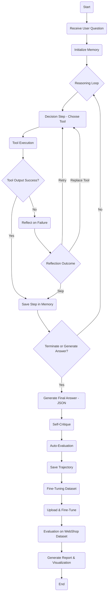

# Agentic_LLM-for-Shopping

  
## Objective
To develop a virtual shopping assistant that assists online shoppers in navigating multiple fashion e-commerce platforms. The agent should interpret user requests, decide which external tools to utilize, and integrate the obtained information to provide coherent and helpful responses.

## Technologies and Techniques used
In this project i’ve go through from different different platforms and techniques to build an agent.

### Libraries for model/agent development
#### Libraries:
LangChain, Ollama, Gorq, OpenAI, HuggingFace, LangGraph, LangSmithand PhiData
The above mentioned libraries that are used for building an agent and model.

### Model/LLMs used:
Gpt-3.5-turbo, gpt-4o, llama-3.2:latest and llama3-70b-8192
I used these model’s using api’s instead of LLama-3.2:latest ( used locally)

### API’s
Since LLMs are large in size so i used API’s of the LLMs to run and for building tools also.
Google, FireCrawl, LangChain, OpenAI, Gorq, WolframApha, Tavily

### Tools used 
Google Search (via Custom Search API) Wikipedia Search Calendar, Calculator, WolframAlpha Firecrawl for advanced web crawling and User current Location.
These are the tools that i used for Discount checker, shipping estimator, return policy checker, competitor price comparison and more .

### Techniques Used
I used different different techniques for building an agent such as ReAct: Synergizing Reasoning and Acting in Language Models, ReST meets ReAct: Self-Improvement for Multi-Step Reasoning LLM Agent, Chain of Tools: Large Language Model is an Automatic Multi-tool Learner, Language Agent Tree Search Unifies Reasoning, Acting, and Planning in Language Models, MultiAgent multitooling self improvement agent .

## About agents and techniques
In this project i’ve used different LLMs and techniques to obtained information to provide coherent and helpful responses from the agent. 
First i build an ReAct agent that provide the LLMs power to use tools for extracting external knowledge and use those knowledge to give better and actual factual response instead of halucinated response. In this agent/technique i observed that the agent was able to give the easy and straightforward anwers but failed complete complex task many times. It wasn’t able to use the tools properly and call the same tool to and fro again and again and did’nt reach to an end as shown in flowchart below and starts to halucinates and reached to a dead end for example if i ask it to “Find a floral skirt under $40 in size S. Is it in stock, and can I apply a discount code ‘SAVE10’?” it give me some results but the links it provided me was not appropriate, it gave the information good in structure but failed to use multiple and complex tools. It gave the answer  “Reached step limit without final answer.” When i program it to multi step reasoning. For complete trajectories go to [ReAct/ReAct_process.txt](https://github.com/harshit4032/Agentic_LLM-for-Shopping/blob/main/ReAct/output.txt). Then models i used in this was Gpt-3.5-turbo and Llama-3.2:latest (wasn't even able to call and use simple tools).

      

Then i tried the multi-step reasoning and self-improvement process of the agent design for complex product search tasks. The flow chart is shown below. 

The Self-Improvement Multi-Step Reasoning LLM Agent is a big step up from the basic ReAct agent. Where ReAct often got stuck repeating the same tools, gave incomplete answers, or just hit a dead end on complex tasks, this agent is able to think more clearly through problems, pick the right tools at the right time, and even learn from its mistakes. It doesn't just try once—it reflects, adjusts, and keeps improving by fine-tuning on the best examples, which makes its answers more accurate and useful, especially for tricky, multi-step questions. But it sometime give incorrect links of the products. To make it even better, we can use better model/LLM i used  Gpt-3.5-turbo for this agent. We can focus on improving how it handles mistakes with smarter retries and better recovery, while also training it to pick the most helpful next steps and expanding the range of tools it has to work with. The logs and trajectories is shown in [/Self-Improvement Multi-Step Reasoning LLM Agent](https://github.com/harshit4032/Agentic_LLM-for-Shopping/tree/main/Self-Improvement%20Multi-Step%20Reasoning%20LLM%20Agent).

Then i tried better models and tools such as Gpt-4o, llama3-70b-8192 and deepseek-r1-distill-llama-70b  for building the agent using Phidata, OpenAIChat and Gorq library. First i tried with  deepseek-r1-distill-llama-70b and i was giving pretty better results but unable to input large context so i moved to Gpt-4o and llama3-70b-8192 models and their results were better than the above agent the product links it provided is from actual site and prodcut and is used FireCrawl tools inbuilt tool in Phidata linbrary helpd a lot in web scraping and crawling which helps in providing the actual and more relevant responses, the  sample output from the agents shown below.

Even though it’s searching products really well with actual links but it fails sometime to use the other coustom tools, this might be the issue because of not proper discription about the tool and the structure of the tool that can be improved. The logs and trajectories is shown in [/Phidata_Agents](https://github.com/harshit4032/Agentic_LLM-for-Shopping/tree/main/Phidata_Agents).

The next technique i used is Language Agent Tree Search (LATS) improves over traditional agents by combining graph-based tree search with reinforcement learning (RL) to unify reasoning, acting, and planning. LATS builds a dynamic search tree where each node represents a reasoning state, and edges correspond to tool actions, allowing the agent to explore multiple solution paths, backtrack, and compare outcomes. Reinforcement learning is used to guide the search by rewarding useful reasoning paths and pruning unhelpful ones, making the agent better at long-term planning and reducing the chance of getting stuck or hallucinating. The logs and trajectories is shown in [/LangAgentTreeSearch](https://github.com/harshit4032/Agentic_LLM-for-Shopping/tree/main/LangAgentTreeSearch)., i used Gpt-3.5-turbo and Gpt-4o models/LLMs
Compared to previous agents like ReAct or standard multi-step agents, LATS is more effective because it doesn’t blindly follow one chain of thought. Instead, it systematically explores alternatives, evaluates outcomes, and optimizes its decision-making over time—leading to higher accuracy, stronger tool use, and more reliable solutions for complex, multi-step tasks. 
The last but not the least agent i tried is Multitooling Multiagent /self improving agent. The idea came from the Phidata agent as it was able to generate actual and accurate products with functional links. The idea is to use multiple agents who’s task is to use tools for a priticular task such as E-Commerce Search Aggregator, Shipping Time Estimator, Discount / Promo Checker, Competitor Price Comparison and Return Policy Checker that is supervised by an one supervisor as shown below which helps in better, more accurate and more reliable responses.  I made the agent using Gpt-3.5-turbo and Gpt-4o. 

    
    

The agent works fine with less number of multitooling agent but when I tried building the supervisor agent with more tooling multitooling agent i encountered an error in creating proper communication between the agents that can be improved by providing better instructions, flow and prompting. This agent i developed using LangGraph as it help in making agent development simple, flexibility, scalability and fault tolerant by increasing reliability. I also built 2 agent that are multitooling and self-improving multitooling agent  the output trajectories is given in [/langchain/Tenimal_Saved_Output.txt.](https://github.com/harshit4032/Agentic_LLM-for-Shopping/blob/main/langchain/Terminal%20Saved%20Output.txt).

## Improvements and Future work 
After analysing these agents, models/LLMs and techniques many improvement can be done such as:
- Better Prompt engineering can be done for better controlling the agent and for agent to understand tools, its usage better and the task to avoid the problem that happened with the ReAct agent.
- Self-Improvement Multi-Step Reasoning technique can be use to instruct the agent when to and where to take action from one state to another in Multitooling Multiagent /self-improving agent it helps in developing communication and flow between agents. 
- Lats technique can be used with multitooling multiagent self–improvemening agent to improve the communication between agents by considering each of them as nodes or states and then use reinforcement learning to develop a policy to transition from one state to another, better actions can be made by improving the policies of the agents using powerfull and state–of–art DRL techniques for complex environments. We can also improve the response time also and minimise the change in transition from one state to another by changing the parameters like reward and penalties which make the agent faster and no need to rely much on the previous stored memory. This also helps in production of the model as it helps in minimizing the cost as we are reducing the api/agent/tool calls.
  
  

- Knowledge Distillation and Quantization like techniques can be used to extract the representations/knowledge from bigger agents/LLMs or system of agents to smaller one which helps in reducing the size and increasing the inference of the whole system/agent without much costing the performance. It will reduce the cost of deploying the agent and which helps in scaling the production while reducing the cost.
- There is plenty of room for using RL techniques with LLM agents. To my knowledge no one is yet working on experimenting different different RL/DRL techniques with LLMs. We can use state–of–art RL techniques like A3C, PPO, TD3 algos for solving complex tasks in complex environments.

These are some of the future work that can be used according to me in improving performance of agents in complex environments and make then better in existing environments.

## Conclusion

Throughout this project, I explored and implemented various advanced techniques and architectures to build a highly capable virtual shopping assistant for fashion e-commerce platforms. Starting from the basic **ReAct agent** to more sophisticated frameworks like **Self-Improvement Multi-Step Reasoning**, **Language Agent Tree Search (LATS)**, and **Multitooling Multiagent systems**, each iteration brought noticeable improvements in tool usage, reasoning, and response accuracy. By leveraging powerful models like **GPT-4o**, **LLaMA 3-70B**, and **DeepSeek**, along with robust tool integrations such as **FireCrawl**, **Google Search**, and **WolframAlpha**, the agent evolved into a more reliable and context-aware assistant capable of handling complex, multi-step queries with real-world outputs, including valid product links and detailed comparisons.

However, despite the progress, there remain areas for further enhancement. Some challenges include ensuring consistent tool usage, handling long-context tasks, and improving the supervisor-agent communication within multitooling frameworks. Future work can focus on refining tool descriptions, optimizing agent coordination, and integrating even more advanced LLMs and reinforcement learning strategies to achieve seamless, scalable, and highly accurate virtual shopping experiences.

This project showcases the potential of agentic LLM systems to revolutionize online shopping by automating complex decision-making, providing real-time insights, and delivering personalized, actionable recommendations with minimal user effort.

## References

1. **ReAct**: Synergizing Reasoning and Acting in Language Models  
   Yao et al., *https://arxiv.org/abs/2210.03629*

2. **Toolformer**: Language Models Can Teach Themselves to Use Tools  
   Schick et al., *https://arxiv.org/abs/2302.04761*

3. **ReST meets ReAct**: Self-Improvement for Multi-Step Reasoning LLM Agent  
   Sun et al., *https://arxiv.org/abs/2310.05255*

4. **Chain of Tools**: Large Language Model is an Automatic Multi-tool Learner  
   Li et al., *https://arxiv.org/abs/2305.14439*

5. **Language Agent Tree Search**: Unifies Reasoning, Acting, and Planning in Language Models  
   Chen et al., *https://arxiv.org/abs/2310.00466*

6. **LangGraph**: Multi-Agent Workflows  
   LangChain Blog, *https://blog.langchain.dev/langgraph-multi-agent-workflows/*

7. **Reinforcement Learning**: A Complete Introduction  
   Towards Data Science, *https://towardsdatascience.com/reinforcement-learning-fda8ff535bb6/*

8. **LATS Tutorial**: Language Agent Tree Search (LATS)  
   LangChain Documentation, *https://langchain-ai.github.io/langgraph/tutorials/lats/lats/*

